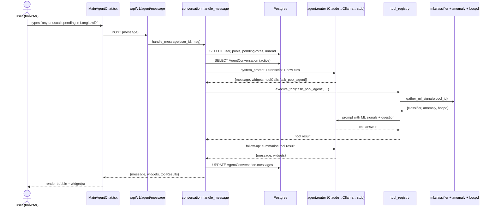

# AI Agent Architecture

A short, practical map of every AI surface in TNG Group Wallet — what
runs where, which model handles which task, and how the pieces connect.

> **TL;DR** — There are **two agents** (a *Pool Agent* per pool and a
> *Main Agent* per user). Both share one **3-tier LLM router** (Claude →
> Ollama → rule fallback) and the same **local ML stack** (DistilBERT
> classifier + Isolation-Forest anomaly + BOCPD changepoint). The Main
> Agent additionally exposes the entire app surface as **MCP-style
> tools** so users can do anything via chat.

---

## 1. Surfaces

| Surface | Scope | Where it lives | Trigger |
|---|---|---|---|
| **Pool Agent** | One per pool | `backend/app/agent/` | Spend evaluation, daily brief, user `ask`, scam check |
| **Main Agent** | One per user | `backend/app/main_agent/` | Sparkle icon on Home → full-screen chat |
| **Pool Advice Card** | One per pool | `web/.../PoolPage.tsx` | Auto-fires `/agent/brief` once per day |
| **AiAdvisorDialog** | Per pool | `web/.../AiAdvisorDialog.tsx` | Floating character on PoolPage |
| **ScamCheck** | Standalone tool | `web/.../ScamCheckPage.tsx` | Manual paste + analyse |

---

## 2. Model stack

### Cloud — Claude (Anthropic)
Used when `ANTHROPIC_API_KEY` is set. Client lives in
[`backend/app/agent/claude_client.py`](../backend/app/agent/claude_client.py).
Best for high-quality reasoning when API budget allows.

### Local — Ollama daemon (`localhost:11434`)
Two models, picked per task type by [`agent/router.py`](../backend/app/agent/router.py):

| Env var | Default | Used for |
|---|---|---|
| `AGENT_DEFAULT_MODEL` | `llama3.2` | General chat, brief, ask, evaluate |
| `AGENT_REASONING_MODEL` | `deepseek-r1:8b` | Structured extraction, splits, forecasts |

DeepSeek's `<think>...</think>` chain-of-thought is stripped before the
caller sees the reply (kept in DEBUG logs).

### Routing logic
[`router.py`](../backend/app/agent/router.py) tries each tier in order
and falls back on the next tier's failure:

```
1. Anthropic Claude          (if API key configured)
2. Ollama (model = task-tier)(if /api/tags reachable)
3. Rule-based stub            (deterministic canned response — never errors)
```

### Trained ONNX models (in-process Python, CPU-only)

| Model | File | Trained on | Purpose |
|---|---|---|---|
| **DistilBERT classifier** | `backend/app/agent/ml/models/tx_classifier.onnx` | ~130 MY-flavoured tx × 24 categories | Tag transactions (`transport_petrol`, `food_dining`, …) |
| **Isolation Forest anomaly** | `backend/app/agent/ml/models/anomaly_detector.onnx` | ~1250 synthetic tx (8% labelled anomalous) | Score each tx on a 13-feature vector; flag outliers |

Both load lazily on first inference (`backend/app/agent/ml/classifier.py`,
`anomaly.py`). If files are missing the inference function returns `None`
and the LLM prompt simply omits the signal — fail-open by design.

Source training pipeline: [`/ml/`](../ml/) (Python). The bat file
`ml/run_training.bat` does `venv → install → train → export` end-to-end;
`ml/copy_artifacts.bat` drops the `.onnx` into `backend/app/agent/ml/models/`.

### BOCPD — Bayesian Online Changepoint Detection
[`backend/app/agent/bocpd.py`](../backend/app/agent/bocpd.py) — pure
NumPy implementation of Adams & MacKay 2007 (Normal-inverse-gamma prior,
constant hazard).

[`bocpd_service.py`](../backend/app/agent/bocpd_service.py) wraps it
per-pool: detector cache keyed by `pool_id`, only replays tx newer than
the cached `last_tx_id` so back-to-back calls are O(new tx). Input is
`log1p(amount)` for stability; hazard 30; alert threshold 0.5.

---

## 3. Memory tables (Postgres)

All four live in the same DB as the rest of the app — no separate store.

| Table | Rows | What it holds |
|---|---|---|
| `PoolAgentMemory` | one per pool | purpose, parsed goals, location, spending plan, observations diary, weather/places/currency cache, refresh timestamps |
| `UserAgentMemory` | one per user | dietary, activity prefs, budget tendency, voting style, preferred language |
| `AgentMessage` | many per pool | per-pool agent-emitted events (DAILY_BRIEF, BUDGET_WARNING, SPEND_EVALUATION, …) |
| `AgentConversation` | one active per user | Main Agent chat — `messages: jsonb[]` of `{role, content, widgets, toolCalls, ts}` plus a small mid-flow scratchpad |

---

## 4. Pool Agent

Per-pool, observation-driven. Lives at `/api/v1/pools/{id}/agent/*`.

| Endpoint | Tool function | Notes |
|---|---|---|
| `POST /setup` | `setup_pool_agent` | Free-text pool description → structured `PoolAgentMemory` (goals, location, spendingPlan) |
| `POST /ask` | `ask` | Q&A with live ML signals injected |
| `POST /brief` | `generate_brief` | 3-sentence daily brief; powers the proactive PoolPage card |
| `GET  /forecast` | `forecast_budget` | End-of-period projection |
| `POST /suggest-split` | `suggest_split` | DeepSeek tier — fairness-aware split |
| `GET  /messages` | `list_agent_messages` | History of agent-emitted events |
| `GET  /context` | (cached weather/places) | Read-only external context |
| `POST /refresh-context` | `refresh_context_if_needed(force=True)` | Force re-fetch external context |
| `POST /agent/check-scam` | `detect_scam` | Pool-less utility, manual scam analysis |

**Behaviour spec** (per `docs/agent-prompts.md`): two agent personalities
— **Trip** (TRIP pools) and **Home** (FAMILY pools). Both follow strict
"stay silent unless it matters" rules. Loan agent is specified but not
wired (no `LOAN` PoolType yet). Source: [`agent/prompts.py`](../backend/app/agent/prompts.py).

### `gather_ml_signals` — the unifier
Every `ask` and `brief` call runs `gather_ml_signals(session, pool_id)`
in [`agent/tools.py`](../backend/app/agent/tools.py) which:

1. Pulls the 100 most-recent transactions for the pool
2. Runs DistilBERT classifier on the top spends → category labels
3. Runs Isolation Forest on the chronological stream → anomaly scores
4. Runs BOCPD on the same stream → changepoint verdict
5. Renders a compact text block pasted into the LLM prompt

The prompt explicitly tells the LLM the spec's thresholds for acting
(e.g. ignore changepoints unless `remaining_budget < remaining_days × prev × 0.7`).

---

## 5. Main Agent (MCP-style tools)

Per-user, conversational. Lives at `/api/v1/agent/*` (alongside the pool
util_router). Code: [`backend/app/main_agent/`](../backend/app/main_agent/).

### Endpoints
```
POST   /api/v1/agent/message          — send a turn, get {message, widgets, toolResults}
GET    /api/v1/agent/conversation     — full chat history
DELETE /api/v1/agent/conversation     — start fresh
POST   /api/v1/agent/action-confirm   — execute a PIN-gated action (after frontend collects PIN)
```

### Tool registry (27 wired)
Every user-facing API is exposed as a callable tool name. The LLM picks
one or more by name + args; the executor runs them sequentially.

| Domain | Tools |
|---|---|
| **Wallet** | `get_balance`, `top_up` |
| **Pools** | `list_my_pools`, `get_pool_detail`, `create_pool`, `archive_pool`, `delete_pool` |
| **Members** | `list_pool_members`, `remove_member`, `leave_pool` |
| **Contributions** | `contribute` *(PIN)*, `list_contributions`, `get_contribution_summary` |
| **Spend requests** | `create_spend_request`, `list_spend_requests`, `vote`, `cancel_spend_request` |
| **Transactions** | `get_my_transactions`, `get_pool_transactions` |
| **Profile / Notifications** | `get_profile`, `update_profile`, `get_notifications`, `mark_notification_read` |
| **Safety / Pool Agent delegation** | `check_scam`, `ask_pool_agent`, `get_budget_forecast`, `suggest_smart_split` |

PIN-gated tools (`contribute`, `archive_pool`) return
`{requiresPin: true, action, params}` instead of executing — the agent
auto-attaches a `pin_required` widget, the frontend collects the PIN in
a bottom sheet, then calls `/action-confirm`.

### Widgets the frontend renders
- `pin_required` — bottom-sheet PIN entry
- `confirmation` — title + key/value summary + Confirm/Edit
- `pool_selector` — list of user's pools, single-tap = pick
- `vote` — Approve / Reject buttons inline

Unwired (no backend yet): `transfer`, `settlement_preview`, income
streams, grants, receipt OCR, loans, contacts API. The system prompt
tells the LLM to reply *"that feature isn't available yet"*.

---

## 6. Data flow — one Main Agent turn



---

## 7. Architecture map

```
┌──────────────────────────────── FRONTEND (React) ─────────────────────────────────┐
│                                                                                   │
│  MainAgentChat ─▶ /agent/message       PoolPage advice card ─▶ /agent/brief       │
│        │                │                       │                                 │
│        └─── widgets ────┤              AiAdvisorDialog ─────▶ /agent/ask          │
│                         │                                    /agent/messages      │
│                  pin_required          ScamCheckPage  ─────▶ /agent/check-scam    │
│                  confirmation                                                     │
│                  pool_selector                                                    │
│                  vote                                                             │
└──────────────────────────────┬───────────────┬───────────────────────────────────┘
                               │               │
                               ▼               ▼
┌────────────────────────── BACKEND (FastAPI) ─────────────────────────────────────┐
│                                                                                   │
│  routes/main_agent.py                routes/agent.py                              │
│        │                                   │                                      │
│        ▼                                   ▼                                      │
│  main_agent/conversation.py          agent/tools.py                              │
│        │                                   │                                      │
│        │  ┌─────── execute_tool ──────────►│                                      │
│        │  │                                │                                      │
│        ▼  ▼                                ▼                                      │
│  main_agent/tool_registry          agent/router (3-tier)                         │
│        │                                   │                                      │
│        │                          ┌────────┼────────┐                            │
│        │                          ▼        ▼        ▼                            │
│        │                       Claude   Ollama    Stub                            │
│        │                                                                          │
│        ▼                                                                          │
│  Existing services                 agent/ml/   ─── classifier (DistilBERT ONNX)   │
│  (pool, contribution, spend,                  └── anomaly    (Iso-Forest ONNX)    │
│   member, …)                       agent/bocpd_service ─── BOCPD detector cache   │
│        │                           agent/external/        ─── weather, places     │
│        │                                                                          │
│        ▼                                                                          │
│  Postgres — User, Pool, PoolMember, Contribution, SpendRequest, Transaction,      │
│             Notification, AgentConversation, PoolAgentMemory, UserAgentMemory,    │
│             AgentMessage                                                          │
└───────────────────────────────────────────────────────────────────────────────────┘
```

---

## 8. Operational quirks

- **Weather refresh cadence**: TRIP pools every 12 h, others every 7 d
  ([`agent/external/context.py`](../backend/app/agent/external/context.py)).
- **Conversation window**: only the last 20 turns are sent to the LLM
  per request — older turns stay in `AgentConversation.messages` for
  display.
- **PIN flow**: PIN is verified **locally** by the frontend; the backend
  trusts that and executes via `/action-confirm`. A `verify-pin` round-trip
  is a TODO if you want server-side enforcement.
- **DeepSeek `<think>` stripping**: chain-of-thought is parsed out at the
  client wrapper, never persisted to `AgentMessage` or returned to the
  user.
- **All agent replies in English**: enforced by `BASE_SYSTEM` in
  [`agent/prompts.py`](../backend/app/agent/prompts.py) (override of the
  earlier "mirror user language" behaviour).
- **`targetAmount` is no longer in pool-agent prompts** — internal budget
  math still uses it (e.g. anomaly normalisation) but the LLM doesn't
  see or report against the target.
- **Memory survives restarts** (Postgres). The BOCPD detector cache is
  in-process only — it converges in ~10 obs after a restart.

---

## 9. Files to know

```
backend/app/
├── agent/                        ← Pool Agent
│   ├── router.py                 (3-tier LLM router)
│   ├── claude_client.py
│   ├── ollama_client.py
│   ├── prompts.py                (Trip + Home behaviour spec)
│   ├── tools.py                  (gather_ml_signals + ask + brief + …)
│   ├── memory.py                 (PoolAgentMemory R/W)
│   ├── state.py                  (pool snapshot)
│   ├── bocpd.py
│   ├── bocpd_service.py          (per-pool detector cache)
│   ├── ml/
│   │   ├── classifier.py         (DistilBERT ONNX)
│   │   ├── anomaly.py            (Iso-Forest ONNX + feature engineering)
│   │   └── models/               (.onnx + tokenizer + label_mapping)
│   └── external/
│       ├── context.py            (refresh aggregator)
│       ├── weather.py            (Open-Meteo)
│       └── maps.py               (Google Places)
│
├── main_agent/                   ← Main Agent
│   ├── prompt.py                 (system prompt + tool catalogue)
│   ├── tool_registry.py          (27 tools + confirm_action)
│   └── conversation.py           (handle_message)
│
└── routes/
    ├── agent.py                  (Pool Agent routes)
    └── main_agent.py             (Main Agent routes)

ml/                                ← Offline training (Python, dev-only)
├── transaction_classifier/        (DistilBERT fine-tune → ONNX export)
└── anomaly_detector/              (Iso-Forest train + synthetic data + ONNX)

web/src/app/components/
├── MainAgentChat.tsx              (Main Agent UI)
├── MainAgentIcon.tsx              (Main Agent SVG)
├── AiAdvisorDialog.tsx            (Pool Agent chat)
└── AiAdvisorIcon.tsx              (Pool Agent floating character)
```
