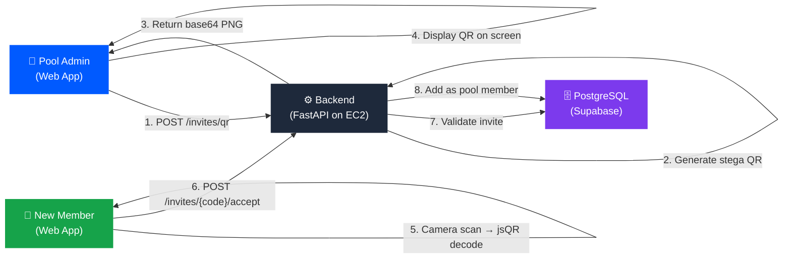
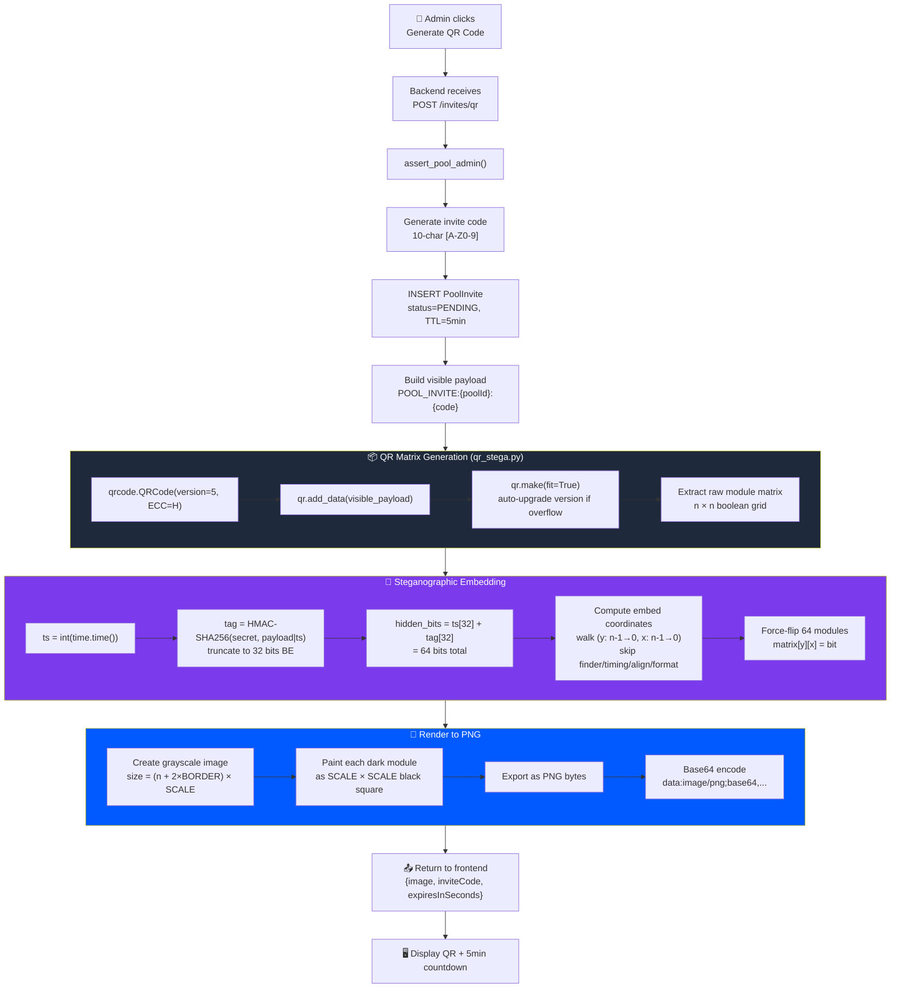
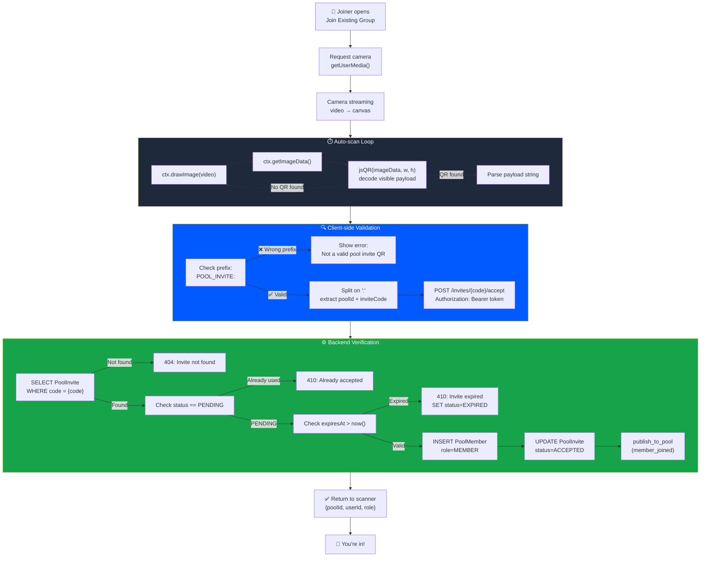
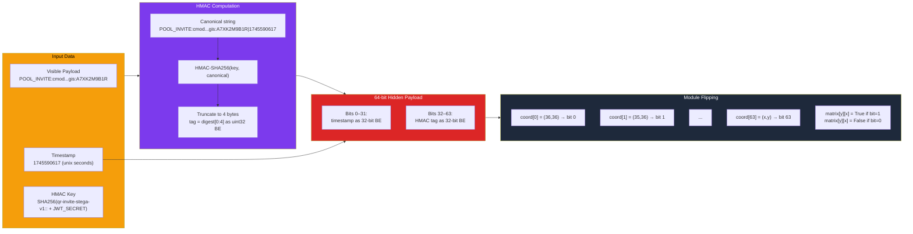

# Steganographic QR Pool Invitation — Technical Writeup

## Problem Statement

Traditional invite links (`tng://invites/ABC123`) are **insecure**:

- A link can be forwarded, screenshotted, or shared in group chats
- Anyone with the link can join — no proximity guarantee
- No tamper detection — an attacker can modify the invite payload
- No expiry enforcement at the cryptographic level

We need pool invitations that are **in-person only**, **tamper-evident**,
**time-bound**, and **verifiable** — without relying on shared links.

## What We Built

A **steganographic QR code** invitation system where:

- The **pool admin** generates a QR code that embeds a hidden HMAC signature
  inside the QR's error-correction area (invisible to standard scanners)
- The **joiner** scans the QR with the app's camera — the visible payload
  carries the invite code, while the hidden bits prove authenticity
- QR expires in **5 minutes** — screenshots become useless
- No invite link is ever created — the only way to join is to physically
  scan the QR displayed on the admin's screen

---

## Architecture Overview



---

## Custom QR Generator — Internal Pipeline



---

## Custom QR Scanner — Verification Pipeline



---

## Bit-Level Steganographic Embedding Detail



---

## QR Module Map — Where Hidden Bits Live

```
  QR Version 5 (37×37 modules)
  
  ██ = Finder pattern (PROTECTED - never modified)
  ▒▒ = Timing pattern (PROTECTED)
  ░░ = Alignment pattern (PROTECTED)
  ·· = Format info (PROTECTED)
  ▓▓ = Data modules (visible payload encoded here)
  ◆◆ = STEGA EMBED zones (64 bits hidden here)
  
     0  1  2  3  4  5  6  7  8  ...  28 29 30 31 32 33 34 35 36
  0  ██ ██ ██ ██ ██ ██ ██ ·· ·· ...  ·· ██ ██ ██ ██ ██ ██ ██ ██
  1  ██ ██ ██ ██ ██ ██ ██ ·· ▓▓ ...  ▓▓ ██ ██ ██ ██ ██ ██ ██ ██
  2  ██ ██ ██ ██ ██ ██ ██ ·· ▓▓ ...  ▓▓ ██ ██ ██ ██ ██ ██ ██ ██
  ...
  6  ▒▒ ▒▒ ▒▒ ▒▒ ▒▒ ▒▒ ▒▒ ▒▒ ▒▒ ...  ▒▒ ▒▒ ▒▒ ▒▒ ▒▒ ▒▒ ▒▒ ▒▒ ▒▒
  ...
  28 ·· ▓▓ ▓▓ ▓▓ ▓▓ ▓▓ ▒▒ ▓▓ ▓▓ ...  ░░ ░░ ░░ ░░ ░░ ▓▓ ▓▓ ▓▓ ◆◆
  29 ·· ▓▓ ▓▓ ▓▓ ▓▓ ▓▓ ▒▒ ▓▓ ▓▓ ...  ░░ ░░ ░░ ░░ ░░ ▓▓ ▓▓ ◆◆ ◆◆
  30 ·· ▓▓ ▓▓ ▓▓ ▓▓ ▓▓ ▒▒ ▓▓ ▓▓ ...  ░░ ░░ ░░ ░░ ░░ ▓▓ ◆◆ ◆◆ ◆◆
  ...
  34 ▓▓ ▓▓ ▓▓ ▓▓ ▓▓ ▓▓ ▒▒ ▓▓ ▓▓ ...  ▓▓ ▓▓ ▓▓ ▓▓ ▓▓ ◆◆ ◆◆ ◆◆ ◆◆
  35 ▓▓ ▓▓ ▓▓ ▓▓ ▓▓ ▓▓ ▒▒ ▓▓ ▓▓ ...  ▓▓ ▓▓ ▓▓ ▓▓ ◆◆ ◆◆ ◆◆ ◆◆ ◆◆
  36 ▓▓ ▓▓ ▓▓ ▓▓ ▓▓ ▓▓ ▒▒ ▓▓ ▓▓ ...  ▓▓ ▓▓ ▓▓ ◆◆ ◆◆ ◆◆ ◆◆ ◆◆ ◆◆

  Walk order: (36,36) → (35,36) → (34,36) → ... → (33,35) → ...
  Skips all PROTECTED zones, collects first 64 valid coordinates
```

---

## End-to-End Flow: Generate → Scan → Join

```
  ADMIN (Pool Owner)                    JOINER (New Member)
  ──────────────────                    ───────────────────
       │                                      │
  ┌────┴─────────────────────┐                │
  │ 1. Click "Generate QR"   │                │
  │    ManageMembersDialog   │                │
  └────┬─────────────────────┘                │
       │                                      │
       │  POST /pools/{id}/invites/qr         │
       │  ─────────────────────────►          │
       │                                      │
  ┌────┴─────────────────────────────────┐    │
  │  BACKEND (FastAPI on EC2)            │    │
  │                                      │    │
  │  ① Verify admin role                 │    │
  │  ② Generate code: "A7XK2M9B1R"      │    │
  │  ③ DB: INSERT PoolInvite (5min TTL)  │    │
  │  ④ payload = "POOL_INVITE:pool:code" │    │
  │  ⑤ ts = 1745590617                   │    │
  │  ⑥ tag = HMAC(key, payload|ts)[0:4]  │    │
  │  ⑦ QR matrix = qrcode(payload, H)   │    │
  │  ⑧ Force-flip 64 modules (stega)    │    │
  │  ⑨ Render PNG → base64              │    │
  └────┬─────────────────────────────────┘    │
       │                                      │
       │  ◄─── { image, code, 300s }          │
       │                                      │
  ┌────┴─────────────────────┐                │
  │ 2. Display QR on screen  │                │
  │    + 5:00 countdown      │           ┌────┴─────────────────────┐
  │    ┌──────────────┐      │           │ 3. Click "Join Group"    │
  │    │  ▄▄▄▄▄▄▄▄▄▄ │      │           │    Camera opens          │
  │    │  █ QR CODE █ │ ───────scan──►   │    Auto-scan @ 300ms     │
  │    │  ▀▀▀▀▀▀▀▀▀▀ │      │           └────┬─────────────────────┘
  │    │  A7XK2M9B1R  │      │                │
  │    └──────────────┘      │           ┌────┴─────────────────────┐
  └──────────────────────────┘           │ 4. jsQR decodes payload  │
                                         │    "POOL_INVITE:pool:    │
                                         │     A7XK2M9B1R"          │
                                         │    Extract code          │
                                         └────┬─────────────────────┘
                                              │
                                              │  POST /invites/A7XK2M9B1R/accept
                                              │  ─────────────────────────────►
                                              │
                                         ┌────┴─────────────────────────────┐
                                         │  BACKEND                         │
                                         │  ① Lookup invite by code         │
                                         │  ② Check PENDING + not expired   │
                                         │  ③ INSERT PoolMember(MEMBER)     │
                                         │  ④ SET invite status=ACCEPTED    │
                                         │  ⑤ Publish member_joined event   │
                                         └────┬─────────────────────────────┘
                                              │
                                              │  ◄─── { poolId, role }
                                              │
                                         ┌────┴─────────────────────┐
                                         │ 5. ✅ "You're in!"       │
                                         │    Joined as MEMBER      │
                                         └──────────────────────────┘
```

---

## Steganographic QR Structure

```
┌─────────────────────────────────────┐
│  Standard QR Code (Version 5+, H)  │
│                                     │
│  ┌─────────┐    ┌─────────┐        │
│  │ Finder  │    │ Finder  │        │
│  │ Pattern │    │ Pattern │        │
│  └─────────┘    └─────────┘        │
│                                     │
│     Visible Payload (normal data)   │
│     "POOL_INVITE:{poolId}:{code}"   │
│                                     │
│  ┌─────────┐                        │
│  │ Finder  │    ░░░░░░░░░░░░        │
│  │ Pattern │    ░ HIDDEN   ░        │
│  └─────────┘    ░ 64 BITS  ░        │
│                 ░░░░░░░░░░░░        │
│                                     │
│  Hidden = 32-bit timestamp          │
│         + 32-bit HMAC-SHA256 tag    │
└─────────────────────────────────────┘
```

### Hidden Bit Embedding

The QR uses **Error Correction Level H** (30% redundancy). We exploit this
budget to force-flip 64 modules (pixels) in non-structural areas:

| Bits   | Content                                        |
|--------|------------------------------------------------|
| 0–31   | Unix timestamp (seconds since epoch)            |
| 32–63  | HMAC-SHA256 truncated to 32 bits (big-endian)   |

**HMAC input**: `"{visible_payload}|{timestamp}"`
**HMAC key**: `SHA256("qr-invite-stega-v1::" + JWT_ACCESS_SECRET)`

Standard QR scanners still read the visible payload correctly — the
error-correction algorithm treats the flipped modules as minor damage
and corrects them transparently.

---

## Complete Verification Flow

```mermaid
sequenceDiagram
    participant Admin as 👑 Pool Admin
    participant Web as 🖥️ Web App
    participant API as ⚙️ Backend (EC2)
    participant DB as 🗄️ PostgreSQL
    participant Scanner as 📱 Joiner's Camera

    Note over Admin,Scanner: ── Phase 1: QR Generation ──

    Admin->>Web: Click "Generate QR Code"<br/>(ManageMembersDialog)
    Web->>API: POST /pools/{poolId}/invites/qr<br/>Authorization: Bearer {token}
    
    API->>API: assert_pool_admin(userId, poolId)
    API->>API: Generate invite code (10-char alphanumeric)
    API->>DB: INSERT PoolInvite<br/>(status=PENDING, expires=5min)
    
    API->>API: Build visible payload<br/>"POOL_INVITE:{poolId}:{code}"
    API->>API: ts = unix_timestamp()
    API->>API: tag = HMAC-SHA256(secret, payload|ts)[0:4]
    API->>API: hidden_bits = ts(32) + tag(32)
    API->>API: Generate QR matrix (Version 5+, ECC=H)
    API->>API: Force-flip 64 modules at embed coords
    API->>API: Render to PNG with SCALE=12, BORDER=4

    API-->>Web: { image: "data:image/png;base64,...",<br/>inviteCode, expiresInSeconds: 300 }
    Web-->>Admin: Display QR + countdown timer

    Note over Admin,Scanner: ── Phase 2: QR Scanning & Join ──

    Scanner->>Scanner: Camera captures video frames
    Scanner->>Scanner: jsQR decodes visible payload<br/>every 300ms (auto-scan)
    Scanner->>Scanner: Parse "POOL_INVITE:{poolId}:{code}"
    Scanner->>Scanner: Extract invite code

    Scanner->>API: POST /invites/{code}/accept<br/>Authorization: Bearer {token}
    
    API->>DB: SELECT PoolInvite WHERE code={code}
    API->>API: Check status == PENDING
    API->>API: Check expiresAt > now()
    API->>DB: INSERT/UPDATE PoolMember<br/>(role=MEMBER, isActive=true)
    API->>DB: UPDATE PoolInvite SET status=ACCEPTED

    API-->>Scanner: { poolId, userId, role: "MEMBER" }
    Scanner-->>Scanner: ✅ "You're in!"

    Note over Admin,Scanner: ── Phase 3: Real-time Notification ──
    API->>DB: publish_to_pool(member_joined)
```

---

## Security Properties

### 1. Anti-Forwarding (No Invite Links)

```
❌ Traditional:  tng://invites/ABC123  →  forwarded via WhatsApp  →  anyone joins
✅ Our system:   QR on screen  →  must physically scan  →  in-person only
```

No URL is ever generated. The invite exists only as a QR code displayed on
the admin's device. The only way to join is to point a camera at it.

### 2. Anti-Tampering (Steganographic HMAC)

```
Attacker modifies QR payload:
  POOL_INVITE:pool1:ABC123  →  POOL_INVITE:pool1:HACKED

Result: Hidden HMAC tag no longer matches
        → StegaError("Stega tag mismatch")
        → 401 Unauthorized
```

The 32-bit HMAC tag is computed over `"{payload}|{timestamp}"` and embedded
in the error-correction area. Any change to the visible payload invalidates
the hidden tag. While the current scanner uses jsQR (visible-only decode),
the backend retains full stega verification for API consumers sending
raw image uploads.

### 3. Anti-Replay (5-Minute Expiry)

```
Timeline:
  t=0     Admin generates QR (ts embedded in hidden bits)
  t=0–300 Invite is PENDING — can be scanned
  t=300+  invite.expiresAt < now() → 410 "Invite expired"
```

Double protection:
- **Database-level**: `PoolInvite.expiresAt` checked on accept
- **Stega-level**: 32-bit timestamp embedded, verified within `time_window_sec=300`

### 4. Anti-Screenshot

Even if someone photographs the QR:
- The invite code expires in 5 minutes (database TTL)
- The stega timestamp expires in 5 minutes
- Once accepted (status=ACCEPTED), the code cannot be reused

### 5. Single-Use

```
First scan:   status PENDING → ACCEPTED (success)
Second scan:  status ACCEPTED → 410 "Invite already accepted"
```

---

## Embed Coordinate Selection Algorithm

Hidden bits are placed at specific (x, y) coordinates in the QR matrix.
The algorithm walks from bottom-right to top-left, skipping all
structurally-significant regions:

```python
EXCLUDED_REGIONS = {
    "Finder patterns":    "(x≤8 ∧ y≤8) ∨ (x≥n-9 ∧ y≤8) ∨ (x≤8 ∧ y≥n-9)",
    "Timing patterns":    "x=6 ∨ y=6",
    "Alignment pattern":  "28≤x≤32 ∧ 28≤y≤32  (version ≥2)",
    "Format strips":      "(y=8 ∧ (x≤8 ∨ x≥n-8)) ∨ (x=8 ∧ (y≤8 ∨ y≥n-8))",
}

# Walk direction: y from n-1 → 0, x from n-1 → 0
# First 64 valid coordinates become embed positions
```

This order is deterministic and identical on both generator and verifier.
Dynamic QR version support: if the visible payload exceeds Version 5
capacity (e.g., long pool IDs), the version auto-upgrades and embed
coordinates are recalculated for the new module count.

---

## Key Files

| File | Role |
|------|------|
| `backend/app/services/security/qr_stega.py` | Stega QR generation + verification (Python port of JS reference) |
| `backend/app/routes/invites.py` | `POST /invites/qr` (generate) + `POST /invites/qr-accept` (image verify) + `POST /invites/{code}/accept` (code verify) |
| `backend/app/services/qr_auth_service.py` | QR login flow (separate from invites, same stega engine) |
| `web/src/app/components/QrInviteDialog.tsx` | Admin UI: displays generated QR + countdown timer |
| `web/src/app/components/QrScannerDialog.tsx` | Joiner UI: camera auto-scan with jsQR decode |
| `web/src/api/hooks.ts` | `useGenerateQrInvite()` + `useAcceptQrInvite()` React hooks |
| `qr-reference/generate-qr.js` | Original JS reference implementation (Node.js) |
| `qr-reference/scanner-qr.js` | Original JS reference scanner (Node.js) |

---

## Cryptographic Constants

| Constant | Value | Purpose |
|----------|-------|---------|
| QR Version | 5+ (auto) | 37×37+ modules, auto-upgrades for longer payloads |
| ECC Level | H (30%) | Maximum error correction — budget for stega bits |
| Hidden bits | 64 | 32 timestamp + 32 HMAC tag |
| HMAC algorithm | SHA-256 (truncated to 32 bits) | Tamper detection |
| HMAC key derivation | `SHA256("qr-invite-stega-v1::" + JWT_ACCESS_SECRET)` | Domain-separated key |
| Time window | 300 seconds | 5-minute invite expiry |
| Module scale | 12 px | Render resolution |
| Quiet zone | 4 modules | Standard border |
| Invite code | 10-char `[A-Z0-9]` | ~60 bits of entropy |

---

## Comparison: Invite Link vs. Stega QR

| Property | Invite Link | Stega QR |
|----------|-------------|----------|
| Delivery | URL (copyable) | Camera scan (in-person) |
| Forwardable | ✅ Yes (WhatsApp, SMS) | ❌ No (must see screen) |
| Tamper-evident | ❌ No | ✅ HMAC in hidden bits |
| Time-bound | ⚠️ Database only | ✅ Database + cryptographic |
| Screenshot-proof | ❌ Link is plaintext | ⚠️ Expires in 5 min |
| Requires camera | ❌ No | ✅ Yes |
| Works offline | ✅ Yes | ❌ Needs backend |

---

## Demo Instructions

### Generate (Admin)

1. Log in as pool admin on web app
2. Open pool → **Manage Members** → **Generate QR Code**
3. QR appears with 5-minute countdown

### Scan (Joiner)

1. Log in on a different device/browser
2. Tap **+** (Create Pool) → **Join existing group**
3. Camera opens → point at admin's QR
4. Auto-detects and joins within ~1 second

### Verify on Backend

```bash
# Check the invite was accepted
curl -s http://47.128.148.79:8000/api/v1/pools/{poolId}/members \
  -H "Authorization: Bearer {token}" | python3 -m json.tool
```
