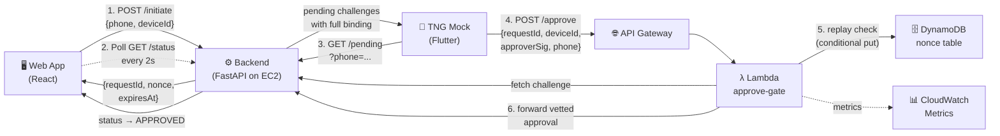
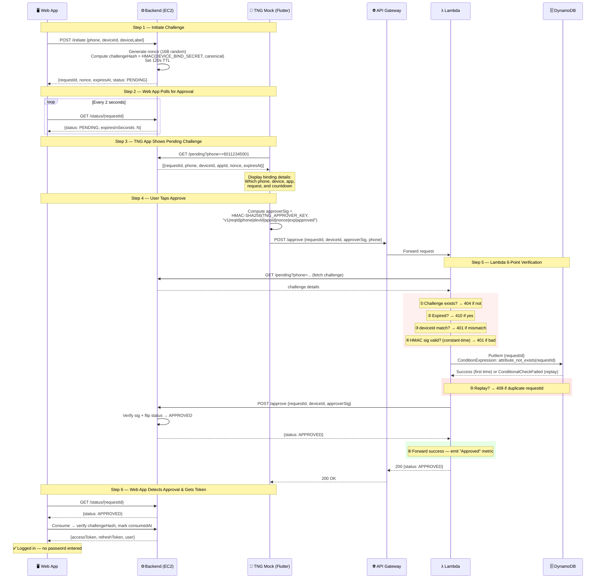

# Device-Bind Passwordless Login — Technical Writeup

## Problem Statement

Traditional authentication (PIN, password, SMS OTP) fails when credentials leak.
A stolen PIN or intercepted OTP lets an attacker log in from **any** device.
We need login that is **bound to a specific device** and requires **out-of-band
approval** from a trusted app (Touch 'n Go eWallet), so even a leaked secret
is useless without physical access to the user's phone.

## What We Built

A **passwordless device-bind login** where:

- The user taps "Sign in" on the **web app** — no password, no PIN, no OTP.
- The **TNG eWallet** (mock Flutter app) receives the approval request showing
  exactly _which phone_, _which device_, _which app_, and _which login request_
  is asking for access.
- The approval goes through an **AWS Lambda checker** that independently
  verifies the cryptographic signature, blocks replay attacks, and only then
  forwards the approval to the backend.

### Architecture Overview



### Sequence Diagram



### ASCII Architecture (for terminals)

```
┌──────────┐   initiate   ┌──────────────┐  poll pending  ┌──────────────┐
│  Web App  │────────────▶│   Backend    │◀──────────────│  TNG Mock    │
│ (React)   │              │  (FastAPI)   │               │  (Flutter)   │
│           │  poll status │   EC2        │               │              │
│           │─────────────▶│  :8000       │               │              │
└──────────┘              └──────┬───────┘               └──────┬───────┘
                                 ▲                              │
                                 │ forward                      │ approve
                                 │ (vetted)                     ▼
                          ┌──────┴───────┐              ┌──────────────┐
                          │              │◀─────────────│ API Gateway  │
                          │   Backend    │              │   /approve   │
                          │              │              └──────┬───────┘
                          └──────────────┘                     │
                                                               ▼
                                                        ┌──────────────┐
                                                        │   Lambda     │
                                                        │ approve-gate │
                                                        │              │
                                                        │ ✓ HMAC sig   │
                                                        │ ✓ expiry     │
                                                        │ ✓ device     │
                                                        │ ✓ replay     │
                                                        │   (DynamoDB) │
                                                        └──────────────┘
```

## Authentication Flow (Step by Step)

### Step 1 — Initiate (Web App → Backend)

The user selects their phone number and taps **Sign in with TNG**.

```
POST /api/v1/auth/device-bind/initiate
{ "phone": "+60112345001", "deviceId": "dev_abc123", "deviceLabel": "Chrome on MacIntel" }
```

The backend:
1. Creates a `DeviceBindChallenge` row in PostgreSQL (Supabase).
2. Generates a cryptographic **nonce** (16 random bytes, base64url).
3. Computes a **challengeHash** = `HMAC-SHA256(DEVICE_BIND_SECRET, canonical)` that
   tamper-seals the entire binding tuple.
4. Sets a **120-second TTL** (`expiresAt`).
5. Returns the challenge to the web app, which starts polling `/status/{requestId}`.

**Canonical binding format** (all fields are part of the signed payload):
```
v1|{requestId}|{phone}|{deviceId}|{appId}|{nonce}|{expiresAt ISO}
```

### Step 2 — Display Pending Challenge (TNG Mock App)

The Flutter mock app polls:
```
GET /api/v1/auth/device-bind/pending?phone=+60112345001
```

It renders the full binding details so the user sees exactly what they're
approving — not just a vague "Yes/No" but:

| Field | Example |
|-------|---------|
| Phone | +60112345001 |
| Device | Chrome on MacIntel |
| App | tng-group-wallet-web |
| Request ID | dbc_AXlu-qYNi… |
| Expires in | 94 seconds |

### Step 3 — Approve (TNG Mock → Lambda → Backend)

When the user taps **Approve**, the Flutter app:

1. Computes the **approver signature**:
   ```
   approverSig = HMAC-SHA256(TNG_APPROVER_KEY, canonical + "|approved")
   ```
2. POSTs to the **Lambda approve-gate** (via API Gateway), NOT directly to the backend:
   ```
   POST https://svzzb7sm2h.execute-api.ap-southeast-1.amazonaws.com/approve
   { "requestId": "dbc_...", "deviceId": "dev_abc123", "approverSig": "7365a4...", "phone": "+60112345001" }
   ```

### Step 4 — Lambda Verification (The AWS Checker)

The Lambda (`tng-approve-gate`) runs **6 independent checks** before forwarding:

| # | Check | Failure Response |
|---|-------|-----------------|
| 1 | Fetch pending challenge from backend | `502 backend unavailable` |
| 2 | Challenge exists and matches requestId | `404 challenge not pending` |
| 3 | Challenge hasn't expired (independent clock check) | `410 challenge expired` |
| 4 | deviceId matches the challenge | `401 device mismatch` |
| 5 | HMAC signature (constant-time compare) | `401 invalid approver signature` |
| 6 | DynamoDB conditional put (replay protection) | `409 replay detected` |

Only after **all 6 pass** does the Lambda forward the approval to the backend.

**Replay protection** uses DynamoDB with a conditional `attribute_not_exists(requestId)`
put — the first submission wins, any duplicate is rejected. Rows auto-expire via
DynamoDB TTL after 24 hours.

### Step 5 — Token Issuance (Backend)

The backend receives the vetted approval, flips the challenge status to `APPROVED`,
and the web app's status poll detects the change:

```
GET /api/v1/auth/device-bind/status/{requestId}
→ { "status": "APPROVED", ... }
```

The web app then calls consume, which:
1. Re-verifies the challengeHash (tamper check on the full binding tuple).
2. Atomically marks `consumedAt = now()` (one-time use).
3. Issues **JWT access + refresh tokens**.

The user is now logged in — no password was ever entered.

## Security Properties

| Threat | Mitigation |
|--------|-----------|
| **Credential leak** (PIN/password stolen) | No credentials exist. Login requires device-bound approval. |
| **Phishing** (fake login page captures OTP) | Nothing to capture — the approval shows the exact binding on the TNG app. |
| **Man-in-the-middle** (intercept and replay approval) | DynamoDB nonce table rejects duplicate requestIds. |
| **Forged approval** (attacker crafts a fake approve call) | HMAC-SHA256 signature over the full canonical binding; constant-time comparison. |
| **Challenge tampering** (modify phone/device mid-flow) | challengeHash seals the binding tuple at creation time; mismatch = reject. |
| **Expired challenge reuse** | 120-second TTL enforced at both Lambda and backend independently. |
| **Device mismatch** (approve from wrong device) | deviceId is part of the signed canonical and checked at Lambda + backend. |
| **Replay of legitimate approval** | DynamoDB conditional put ensures each requestId is accepted exactly once. |

## AWS Infrastructure

| Component | Resource | Purpose |
|-----------|----------|---------|
| **EC2** | `i-0de671d4968284b94` (t2.micro) | FastAPI backend — `http://47.128.148.79:8000` |
| **Lambda** | `tng-approve-gate` (Python 3.12, 256 MB) | Signature verification + replay protection |
| **API Gateway** | `svzzb7sm2h` (HTTP API) | Public HTTPS endpoint for Lambda |
| **DynamoDB** | `tng-device-bind-nonces` (on-demand) | Replay protection nonce table with TTL |
| **IAM** | `tng-approve-gate-role` | Lambda execution role (logs + DynamoDB + CloudWatch) |
| **CloudWatch** | `TNG/DeviceBind` namespace | Metrics: Approved, BadSignature, ReplayDetected, etc. |

### Architecture Rationale

- **Lambda for the checker** — stateless, pay-per-invocation, scales to zero.
  The verification logic doesn't need a persistent server.
- **DynamoDB for nonces** — single-digit-ms conditional puts with auto-TTL
  cleanup. No cron jobs needed.
- **EC2 for the backend** — the FastAPI app needs PostgreSQL connections,
  WebSocket support, and opencv for QR stega. A full server is simpler than
  wrestling with managed runtime limitations.
- **API Gateway (HTTP API)** — free TLS termination, CORS, request routing.
  No API keys needed for this demo.

## Key Files

| File | Description |
|------|-------------|
| `backend/app/services/device_bind_service.py` | Core business logic — initiate, approve, reject, consume, canonical hashing |
| `backend/app/routes/auth.py` | REST endpoints — `/initiate`, `/pending`, `/approve`, `/reject`, `/status` |
| `backend/app/models.py` | `DeviceBindChallenge` SQLAlchemy model |
| `aws/lambda_approve_gate/lambda_function.py` | Lambda checker — sig verify, replay detect, forward |
| `aws/lambda_approve_gate/trust-policy.json` | IAM trust policy (Lambda assumes role) |
| `aws/lambda_approve_gate/exec-policy.json` | IAM execution policy (DynamoDB + CloudWatch + Logs) |
| `mock_approval/lib/main.dart` | Flutter mock TNG app — polls pending, computes HMAC sig, sends to Lambda |
| `web/src/api/hooks.ts` | React hooks — `useDeviceBindLogin` (initiate + poll status) |
| `web/src/app/LoginPage.tsx` | Login UI — phone selector, TNG approval flow with countdown |

## Cryptographic Details

**Two independent HMAC keys**, each protecting different trust boundaries:

| Key | Held by | Protects |
|-----|---------|----------|
| `DEVICE_BIND_SECRET` | Backend only | `challengeHash` — tamper-seals the binding tuple so no field can be modified between initiate and consume |
| `TNG_APPROVER_KEY` | Backend + TNG (Lambda) | `approverSig` — proves the approval came from the TNG app, not a forged HTTP call |

**Signature computation** (both sides must produce identical output):
```python
canonical = "v1|{requestId}|{phone}|{deviceId}|{appId}|{nonce}|{expiresAt}"
approverSig = HMAC-SHA256(TNG_APPROVER_KEY, canonical + "|approved")
```

The `v1` prefix allows future format changes without breaking existing clients.

## Demo Instructions

1. **Start the web app** — `cd web && npm run dev` (Vite proxies `/api` to backend)
2. **Start the backend** — running on EC2 at `47.128.148.79:8000`
3. **Open the Flutter mock app** — `cd mock_approval && flutter run -d macos`
4. **Sign in** — select a phone number on the web login page, tap "Sign in with TNG"
5. **Approve** — the Flutter app shows the pending challenge; tap Approve within 120s
6. **Done** — the web app detects approval and issues tokens automatically
